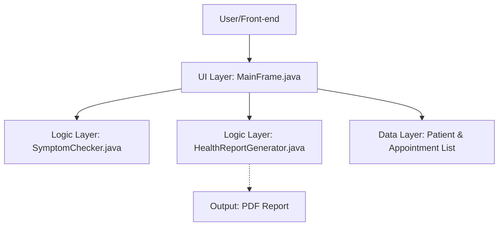

# Smart Healthcare System

A simple, Java-based healthcare management system with a graphical user interface (Swing), in-memory data storage, a rule-based symptom checker, and PDF report generation.

## Features

- **Patient Management**: Add and view patients (ID, Name, Age, Gender).
- **Appointment System**: Book appointments for registered patients.
- **Symptom Checker**: A "smart" rule-based system that suggests possible conditions based on symptoms.
- **PDF Report Generation**: Generate a professional PDF report containing patient details and the last diagnosis.

## Prerequisites

- Java Development Kit (JDK) 11 or higher.
- Apache Maven installed.

## How to Run

1. **Clone or Download** the project files into a folder.
2. **Navigate** to the project root directory (where `pom.xml` is located).
3. **Compile and Download Dependencies**:
   ```bash
   mvn clean install
   ```
4. **Run the Application**:
   ```bash
   mvn exec:java -Dexec.mainClass="com.smarthealth.ui.MainFrame"
   ```

## Usage Instructions

1. **Add Patient**: Go to the "Add Patient" tab, fill in the details, and click "Add Patient".
2. **View Patients**: Go to the "View Patients" tab and click "Refresh" to see the list.
3. **Book Appointment**: Use a valid Patient ID to book an appointment with a doctor.
4. **Symptom Checker**: 
   - Enter symptoms like "fever, cough" or "headache, nausea".
   - Click "Check Symptoms" to see the suggestion.
   - Enter the Patient ID and click "Generate PDF Report" to save a PDF file in the project root.

## Architecture
The Smart Healthcare System is built using a simple 3-tier architectural approach to ensure modularity and ease of maintenance.

### System Flow Diagram


### Components
1. **Presentation Layer (Swing UI)**: 
   - `MainFrame.java`: The central hub that manages the graphical interface, user events, and local data state.
2. **Logic Layer (Business Logic)**:
   - `SymptomChecker.java`: A rule-based engine that maps symptom combinations to possible medical conditions.
   - `HealthReportGenerator.java`: Specialized component using iText 7 to produce structured PDF reports.
3. **Data Layer (In-Memory)**:
   - Uses Java `ArrayList` to store `Patient` and `Appointment` objects during the application session.

---

## Project Report

### 1. Project Background
This project was developed as a college-level smart healthcare management system. It aims to demonstrate the practical application of Core Java, GUI development (Swing), and external library integration (iText).

### 2. Technology Stack
- **Language**: Java 11
- **UI Framework**: Java Swing (AWT/Swing)
- **Dependency Management**: Maven
- **Core Dependencies**: 
  - `com.itextpdf`: For dynamic PDF report generation.
  - `slf4j-simple`: For lightweight logging support.

### 3. Key Functionalities & Successes
- **Automated Diagnosis**: Successfully implemented a rule-based system for preliminary health assessment.
- **Dynamic Report Generation**: Generates persistent PDF artifacts for patient records.
- **Data Integrity**: Maintains cross-references between appointments and patient IDs.

### 4. Implementation Details
The system organizes code into logical packages:
- `com.smarthealth.model`: Entity classes.
- `com.smarthealth.logic`: Core functional logic.
- `com.smarthealth.ui`: Visual interface.

### 5. Future Scope
- Integration with a persistent database (e.g., SQLite or MySQL).
- Enhanced "smart" diagnostic logic using machine learning.
- Patient history tracking and graphical analytics.
